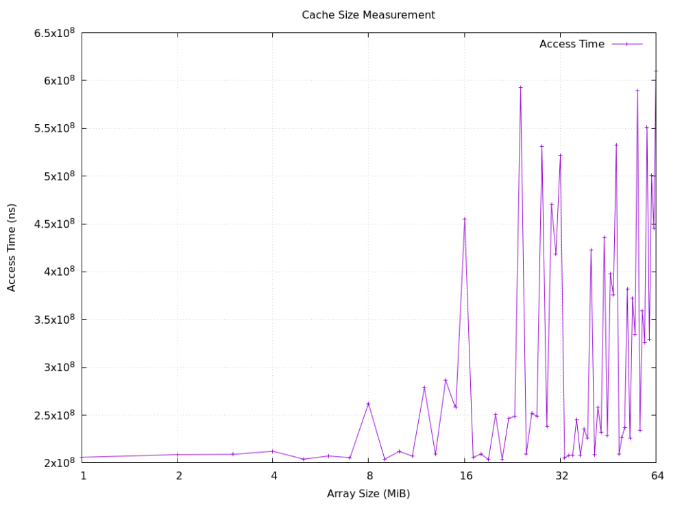

# Side-Channel
This program is designed to infer the size of the Last Level Cache of a CPU by measuring how long it takes to modify data in an array, as the array size increases.

It is done by iteratively increasing the array size by 1MiB, starting from 1Mib to 32Mib. Outputting the array size (in bytes) and the access time (ns) to the console.
The output can then by converted into a graph using the gunpolt file.

Example Usage: 
` ./script.sh `

Example output:

